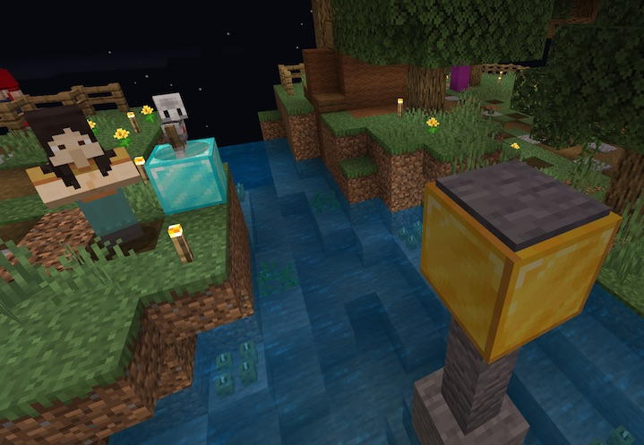
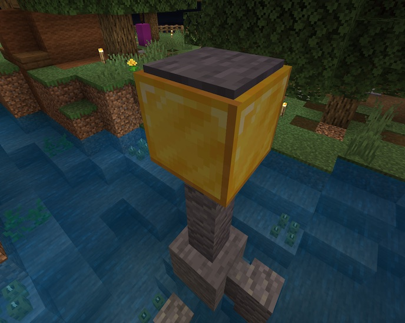

### @flyoutOnly true
### @diffs true
### @hideDone true
### @codeStart players set @s codeExecution 1
### @codeStop players set @s codeExecution 0

# Python Islands 1 - Lake

```template
agent
```

## Getting started with the Agent  @showdialog

In this task, it's time to learn how to move your Agent around!



## Python Programs recap

Python programs are made up of one or more instructions, that the computer will execute one after another.

## Your Agent

Have a look around in the world. You should see your Agent, standing on the blue diamond block.

This awesome little robot can move around the world, even fly!

Head to the next step and we'll start telling your agent to move.

## Moving your agent

Move your agent with `||agent:agent.move(DIRECTION, BLOCKS)||`

**Try changing the `DIRECTION`. What happens if you change FORWARD to another direction, perhaps BACK or LEFT? What happens if you increase the `BLOCKS` to 2 or 3?**

```python
agent.move(FORWARD, 1)
```

## Target 1 @showdialog

Now you know how to move your agent up, down, left, right, forward and back, you can now move onto something a little more difficult!



## Get to Target 1
Can you move your agent, using `||agent:agent.move(DIRECTION, BLOCKS)||`, to stand on the pressure pad on the golden block?

**Using `||agent:agent.move(DIRECTION, BLOCKS)||`, move your agent to the Golden block.**

```python
agent.move(FORWARD, 3)
agent.move(UP, 1)
agent.move(RIGHT, 5)

```