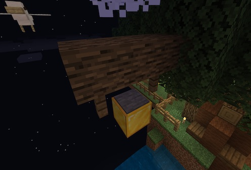

### @flyoutOnly true
### @diffs true
### @hideDone true
### @codeStart players set @s codeExecution 1
### @codeStop players set @s codeExecution 0

# Python Islands 1 - Lake: Target 2

```template
agent
```

## Head to Target 2   @showdialog

Finally, can you move your agent over to the second golden block, to your left?

It is up in the tree.



## Target 2

Using `||agent:agent.move(DIRECTION, BLOCKS)||`, move your agent to the Golden block in the tree.

```python
agent.move(LEFT, 7)
agent.move(BACK, 1)
agent.move(DOWN, 1)
agent.move(LEFT, 1)
```