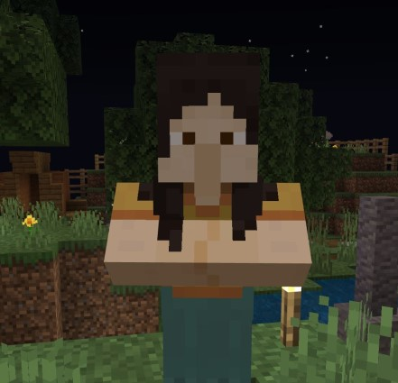

### @flyoutOnly true
### @diffs true
### @hideDone true
### @codeStart players set @s codeExecution 1
### @codeStop players set @s codeExecution 0

# Python Islands 1 - Whistle

## Task Complete @showdialog
### Agent Licence

Great job! I am happy to award an **Agent Licence** to you.

You might find this useful if you want to help out other folks on the island, as it proves you know how to use your Agent.

## Whistle @showdialog

   

You have also now been given a **Whistle**.

If you **right click** while holding it in your hand, it will **call your agent** to you, from wherever it might be in the world.

Oh and, if you ever lose your whistle, come back and see me.
