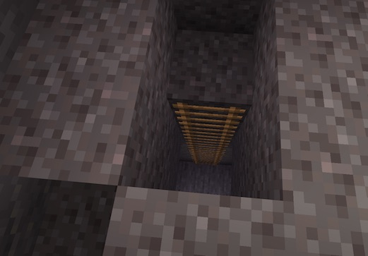

### @flyoutOnly true
### @diffs true
### @hideDone true
### @codeStart players set @s codeExecution 1
### @codeStop players set @s codeExecution 0

# Mine - 2 ladder

```template
// Nothing here to code!
```

```ghost
```


## Ladders! @showdialog

"Now that we have ladders, I have gone and placed them for you. Why not head down and explore?"



## Close the editor
Close this window by pressing ESC or clicking the X at the top right of the Code Builder.

```python
```