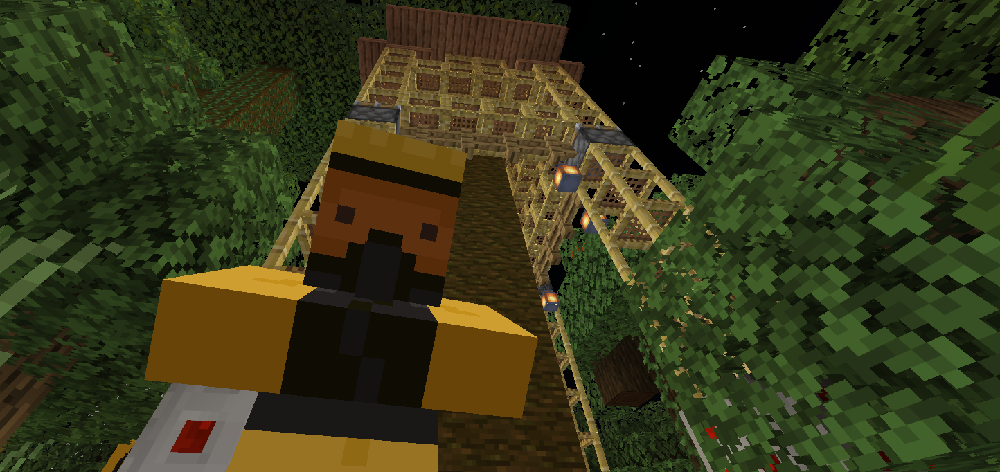

### @flyoutOnly true
### @diffs true
### @hideDone true
### @codeStart players set @s codeExecution 1
### @codeStop players set @s codeExecution 0

# Forest

```ghost
agent.move(FORWARD, 1)
agent.destroy(FORWARD)
for (let i = 0; i < 5; i++){
    agent.destroy(UP)
    agent.move(UP, 1)
    player.say("up 1")
}
```

## Taking down the Tree @showdialog

Help the Tree Experts take down the rotting tree! As your agent can fly up and down, they have asked you if you can help remove a bulk of the tree trunk.

Don't worry though, supports and scaffolding have been put in place to hold the top part up while you work, so it will not collapse.



## Step 1

To start, we'll need to remove the base of the tree. This is as simple as removing the bottom 4 blocks with your agent using ``||agent:agent.destroy||``, and moving using ``||agent:agent.move||`` to the next block!

**Using ``||agent:agent.destroy||`` and ``||agent:agent.move||`` remove the 4 logs at the bottom of the tree!**

```spy
agent.destroy(FORWARD)
agent.move(FORWARD, 1)
agent.destroy(FORWARD)
agent.move(BACK, 1)
agent.move(RIGHT, 1)
agent.destroy(FORWARD)
agent.move(FORWARD, 1)
agent.destroy(FORWARD)
```

## Step 2

Now that you have the bottom layer of logs removed from the tree. Let's remove a stack of logs! You can use a ``||loops:for||`` loop to repeat the same code over and over again, a set number of times.

**Create a ``||loops:for||`` loop in your code that repeats 12 times**

*Use the hint if you need a reminder of what a for loop looks like*


```spy
for (let count = 0; count < 12; count++){
    // Code to be repeated
    player.say("Hi")
}
```

## Step 3

Great, now with your `for` loop ready, let's use it to destroy above the agent and then move up!

**Using ``||agent:agent.destroy||`` and ``||agent:agent.move||``, program the agent to destroy `12` logs.**

```diffspy
for (let count = 0; count < 12; count++){
    // Code to be repeated
    player.say("Hi")
}
-------------------------
for (let count = 0; count < 12; count++){
    agent.destroy(FORWARD)
    agent.move(UP, 1)
}
```

## Finish taking down the tree

Great!

With one length of logs removed, move your agent to the bottom of each log and remove them all. Good luck!
