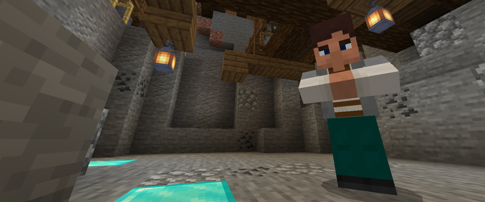

### @flyoutOnly true
### @diffs true
### @hideDone true
### @codeStart players set @s codeExecution 1
### @codeStop players set @s codeExecution 0

# Mine

```template
```

## Gold Digging! @showdialog

Recently the island has come across a few stray blocks of gold which they can use to help advance their technology! Michael has asked if you're willing to help mine some gold ore, with the Agent, in the areas that would not be safe for people to go down.



## Step 1

Michael has an idea of where these blocks of gold are underground. He got his team of miners to replace the top blocks to cobblestone to show where to dig down!

To start, let's use ``||agent:agent.move||`` and move onto the first block.

**Move the Agent FORWARD one block to step on top of the cobblestone.**

```python
agent.move(FORWARD, 1)
```

## Step 2

Now to start digging! Michael knows that the gold is going to be three blocks below the surface.

For this, we will need to use ``||agent:agent.destroy||`` and ``||agent:agent.move||`` to dig `DOWN` underground. To repeat this three times, we'll use a ``||loops:for||`` loop.

**Create a ``||loops:for||`` loop to repeat three times and have the Agent destroy the block below it and move down.**

```python
for dig in range(0,3):
    agent.destroy(DOWN)
    agent.move(DOWN, 1)
```

## Step 3

As we're three blocks below the surface, we need to check if there's gold. For this, we'll use an `if` statement as well as ``||agent:agent.inspect||`` to get the details of the block. Then to get the name of the block we can look using an ``||logic:if||`` . Michael has warned us that if it's not gold, then **breaking the block could make the agent fall off the island!**

**Add an ``||logic:if||`` statement to check if the block below the agent is `GOLD_ORE`. If it is, destroy it!**

```python
for dig in range(0,3):
    agent.destroy(DOWN)
    agent.move(DOWN, 1)
block = agent.inspect(AgentInspection.BLOCK, DOWN)
if block == GOLD_ORE:
    agent.destroy(DOWN)
```

## Step 4

Nice! With any gold extracted and the stone left in place, we'll move the agent back up the tunnel!

**Use ``||agent:agent.move||`` to move your agent up, `3` blocks.**
```python
for dig in range(0,3):
    agent.destroy(DOWN)
    agent.move(DOWN, 1)
block = agent.inspect(AgentInspection.BLOCK, DOWN)
if block == GOLD_ORE:
    agent.destroy(DOWN)
agent.move(UP, 3)
```

## Step 5

Now your code is done, try mining out the first tunnel.

## Step 5

With the main code out of the way and completed time to put it all together and get it working!

Most of the code is here but, it's not ready yet...

**Create another ``||loops:for||`` loop to run the tunnel checking code `3` times with the code you already have, and then make the agent move forward at the end!**

```python
for tunnel in range(0,3):
    for dig in range(0,3):
        agent.destroy(DOWN)
        agent.move(DOWN, 1)
    block = agent.inspect(AgentInspection.BLOCK, DOWN)
    if block == GOLD_ORE:
        agent.destroy(DOWN)
    agent.move(UP, 3)
agent.move(FORWARD, 1)
```