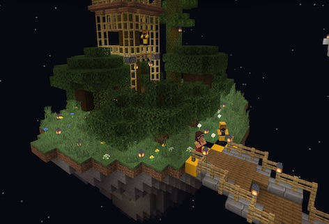

### @flyoutOnly true
### @diffs true
### @hideDone true
### @codeStart players set @s codeExecution 1
### @codeStop players set @s codeExecution 0

# Go to the forest!

```template
// Nothing here to code!
```

```ghost
```

## Collect some wood from the forest to finish the Mine @showdialog




To get the gold needed for the crown, you must first help finish the construction of the Mine. Collect some wood from the Forest, then bring it to the Mine.

```spy

```