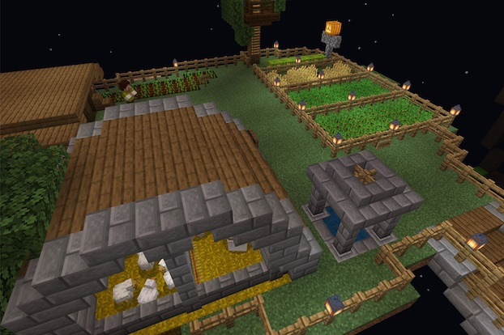

### @flyoutOnly true
### @diffs true
### @hideDone true
### @codeStart players set @s codeExecution 1
### @codeStop players set @s codeExecution 0

# Head to the farm

```template
// Nothing here to code!
```

```ghost
```

## Get some wool from the farm @showdialog



Head to the farm and get some wool for the wizard to make the robe for the king.
```spy

```