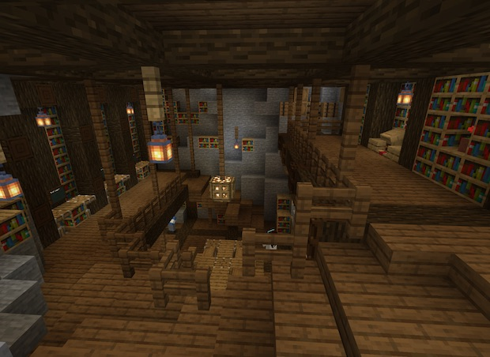

### @flyoutOnly true
### @diffs true
### @hideDone true
### @codeStart players set @s codeExecution 1
### @codeStop players set @s codeExecution 0

# Head to the Library!

```template
// Nothing here to code!
```

```ghost
```

## Get the spellbook from the library @showdialog



Head to the library (via the staircase in the castle) and find the spellbook for the wizard.

```spy

```