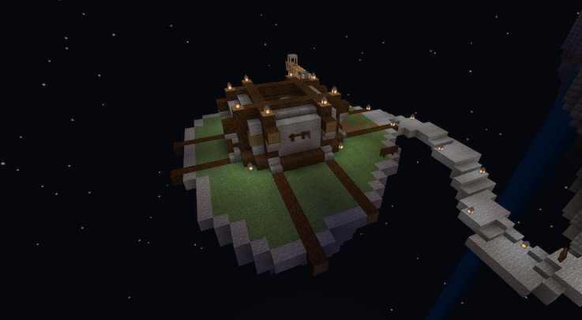

### @flyoutOnly true
### @diffs true
### @hideDone true
### @codeStart players set @s codeExecution 1
### @codeStop players set @s codeExecution 0

# Head to the Mine!

```template
// Nothing here to code!
```

```ghost
```

## Get some Gold from the Mine @showdialog



Now that you have the wood, bring it to the Mine and collect some gold for the Crown.


```spy

```