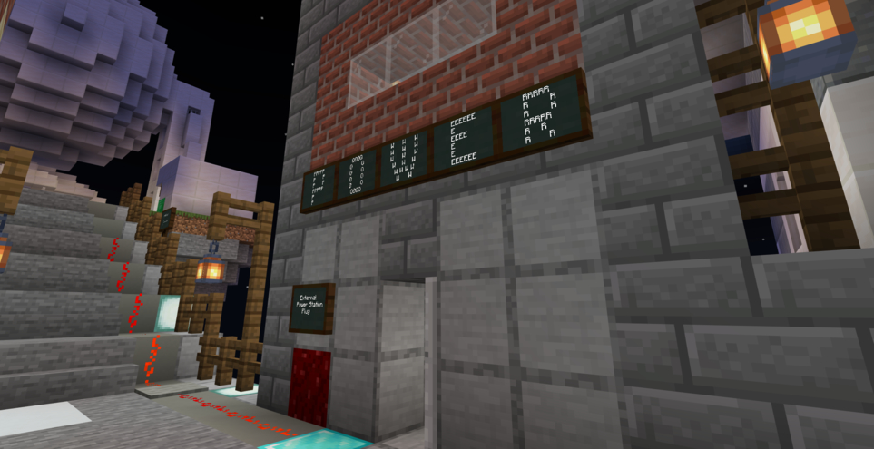

### @flyoutOnly true
### @diffs false
### @hideDone true
### @codeStart players set @s codeExecution 1
### @codeStop players set @s codeExecution 0

# Wire

```customts
namespace positions {
    /**
    * Provides a corrected location
    */
    //% block"Correct Location %pos"
    export function correctLocation(pos: Position) {
        const y = pos.getValue(Axis.Y)-1
        return world(pos.getValue(Axis.X), y, pos.getValue(Axis.Z))
    }
}

agent.set_slot(1)
```

```ghost
function on_travelled_walk(){
    let loc = player.position()
    loc = positions.correct_location(loc)
    agent.teleport(loc, WEST)
    agent.place(DOWN)
}

player.on_travelled(WALK, on_travelled_walk)
```

## Wire to the Power Station @showdialog

With the telescope built and ready to start searching the stars, the final thing it needs is power! You need to hook up a wire between the Power Station and the transformer building on the telescope island.

As the wire is fragile, you will use your agent to do this.

Could you program your Agent to follow you along the bridge and place down the wire as it does?



## Step 1

To begin, you'll need to create a function that will run every time you move. To do this we first need to make a function that minecraft will call when we move, we'll call this `on_travelled_walk()`.

**Can you start by creating a function called `on_travelled_walk()`**

```python
def on_travelled_walk():
    # We'll add code here in the steps to come
    pass
```

## Step 2

Now your program will need to know where you've walked, to do this we'll add a *variable* called `loc` and assign it ``||player:player.position()||``.

```python
def on_travelled_walk():
    loc = player.position()
```

## Step 3
As you walk, you need to get the exact location for your Agent to place down the wire. For this, we can use the `loc` variable we just added.

To correct the location for the Agent to use, we'll run the `||positions:positions.correct_location()||` function and pass in our `loc` variable. Then storing the result as our new `loc`.

**On a new line, set `loc`, to equal to the `||positions:positions.correct_location()||` function and pass our `loc` variable as the `position`.**

```python
def on_travelled_walk():
    loc = player.position()
    loc = positions.correct_location(loc)
```

## Step 4
The next step is to teleport your Agent to the corrected position. To teleport your Agent you can use ``||agent:agent.teleport()||``.

**Add the code to teleport your Agent to our `loc` variable facing `WEST`.**

```python
def on_travelled_walk():
    loc = player.position()
    loc = positions.correct_location(loc)
    agent.teleport(loc, WEST)
```

## Step 5
The last step is to have your Agent place down the wire to make the connection.

The Power Station staff have already given your Agent some wire. All you need to do is use ``||agent:agent.place()||`` to place it `DOWN`.

**Add an ``||agent:agent.place||`` below so it places `DOWN`.**

```python
def on_travelled_walk():
    loc = player.position()
    loc = positions.correct_location(loc)
    agent.teleport(loc, west)
    agent.place(DOWN)
```

## Step 5
The final step is to make sure the game triggers our code when we travel, to do this we can use ``||player:player.on_travelled()||``. This this two prameters the mode of travel which is `WALK` for us to lay the wire, and the second being the name of the function we want to trigger.

**At the end of your code add in ``||player:player.on_travelled()||`` with the prameters of `WALK` and the name of our function `on_travelled_walk` that we made**

```python
def on_travelled_walk():
    loc = player.position()
    loc = positions.correct_location(loc)
    agent.teleport(loc, west)
    agent.place(DOWN)

player.on_travelled(WALK, on_travelled_walk)
```

## Start placing wire!

When you're ready, run your code and slowly walk on the path to the right of the bridge, so your Agent will follow and place the wire. You should start from the "**External Power Station Plug**".
